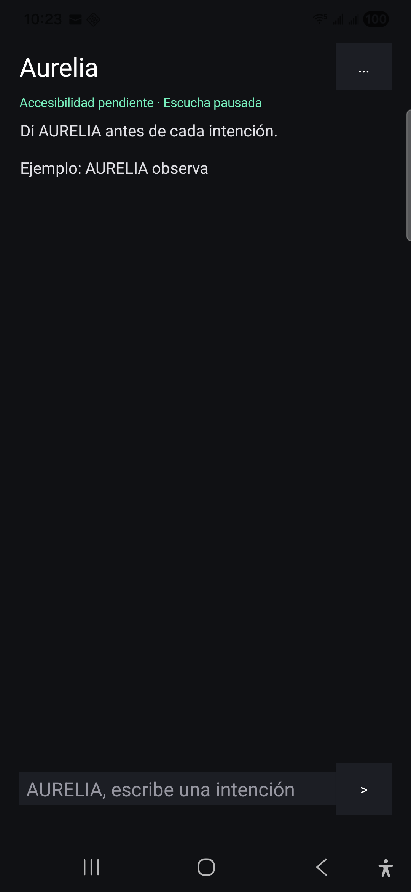

# Aurelia — Visible Autonomy

[](https://davidpeguero27.github.io/aurelia-synapsis-showcase/)
[](https://github.com/davidpeguero27/aurelia-synapsis-showcase/actions/workflows/deploy-pages.yml)
[](https://github.com/davidpeguero27/aurelia-synapsis-showcase/stargazers)

Aurelia is a local-first, supervised automation agent for Android and Windows.
It turns a human intention into a bounded sequence of visible, verifiable
actions while leaving sensitive final decisions under direct human control.



This repository contains only the sanitized public showcase website. It does
not include the private Aurelia runtime, credentials, operational logs, device
diagnostics, financial modules, or private user data.

## Help people discover Aurelia

If visible, safety-first autonomy is useful to you:

- [Give Aurelia a star](https://github.com/davidpeguero27/aurelia-synapsis-showcase) to help other builders find it.
- [Open the live demo](https://davidpeguero27.github.io/aurelia-synapsis-showcase/) and share it with someone interested in AI agents.
- [Start a discussion](https://github.com/davidpeguero27/aurelia-synapsis-showcase/discussions) with an idea, question, or use case.
- [Report an issue](https://github.com/davidpeguero27/aurelia-synapsis-showcase/issues/new/choose) if something in the public showcase does not work.

## Public demo

- Live showcase: https://aurelia-synapsis-showcase.davidpeguero27.chatgpt.site
- GitHub Pages: https://davidpeguero27.github.io/aurelia-synapsis-showcase/

## What makes Aurelia different

- **Visible actions:** device work is observable instead of hidden.
- **Human verification:** payments, credentials, private codes, and final
  confirmations stay under direct human control.
- **Local-first design:** validation and policy decisions remain local whenever
  possible.
- **Cross-device direction:** Android, Windows, a Python backend, and assisted
  planning work as one supervised system.
- **Auditable learning:** results and failures can become safer reusable flows
  only after verification.
- **Bound approvals:** short-lived, single-use SHA-256 digests bind visible
  approval to the exact action preview and parameters.
- **Uncertain-outcome safety:** if execution may have happened but cannot be
  verified, Aurelia reports `outcome_unknown` and blocks automatic retries.

## Safety model

Aurelia is designed to automate only low-risk, reversible, observable tasks
after local validation. Credentials, private codes, payments, transfers,
trading, account changes, destructive actions, and final sensitive
confirmations remain human-controlled.

The public demo describes the architecture and interaction model. It does not
connect visitors to a live device, private backend, or external account.

## Run locally

Requirements:

- Node.js 20 or newer
- npm

```powershell
npm ci
npm run dev
```

Open the local URL printed by Vite.

## Validate a production build

```powershell
npm ci
npm run build
npm run start
```

## Project status

Aurelia is an experimental private-alpha project. The public showcase is
informational and does not imply endorsement, certification, or partnership
with OpenAI or any other model or platform provider.

## Contact

- [Support Aurelia development with PayPal](https://www.paypal.com/qrcodes/managed/c9c78910-7802-4090-9c34-a0ac2ef55026?utm_source=aurelia_github_readme)
- [Join the public discussion](https://github.com/davidpeguero27/aurelia-synapsis-showcase/discussions)

For pilot or development-support inquiries:
`legacycreator@protonmail.com`

## License

The showcase source and visual assets are provided under the terms in
[LICENSE](LICENSE). No rights to the private Aurelia runtime are granted.
